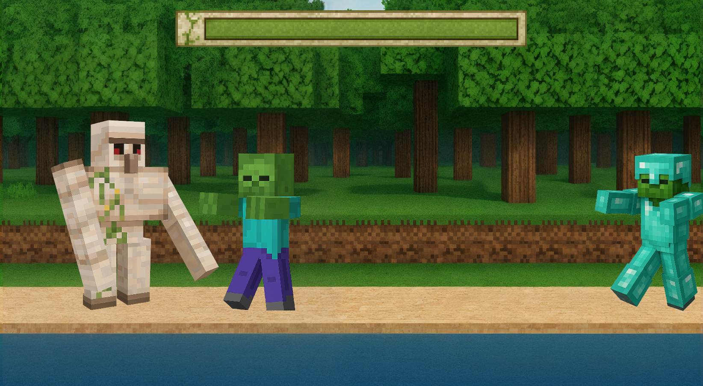
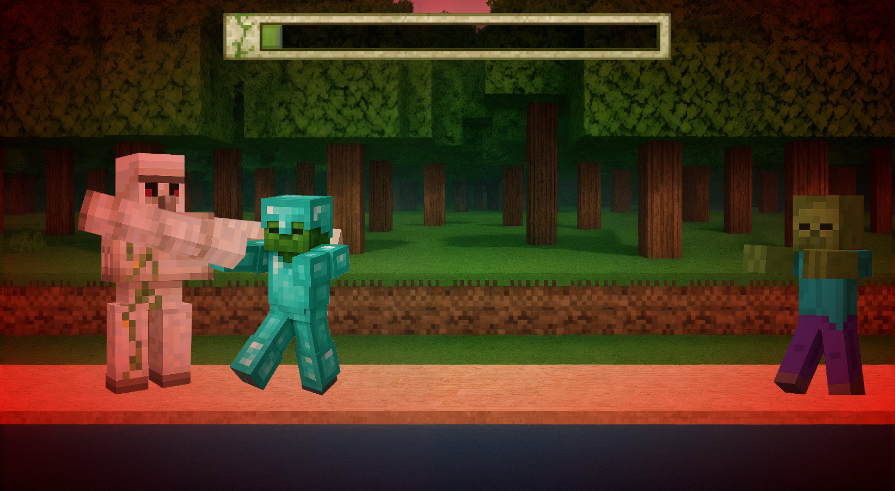
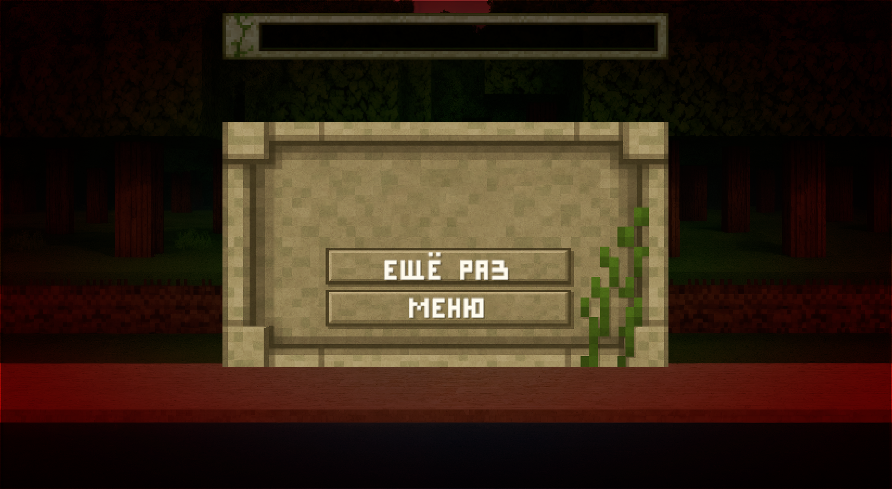

# Golem Attacks

Исходный код игры **Golem Attacks** для платформы [Яндекс Игры](https://yandex.ru/games/).

## Архитектура

- **SOLID** — принципы проектирования применяются на всех уровнях кодовой базы
- **ООП** — объектно-ориентированный подход к моделированию игровых сущностей
- **Сервисная архитектура** — бизнес-логика вынесена в отдельные сервисы с чёткими зонами ответственности
- **Кастомный Dependency Injection** — собственная реализация DI-контейнера для управления зависимостями

## Скриншоты

